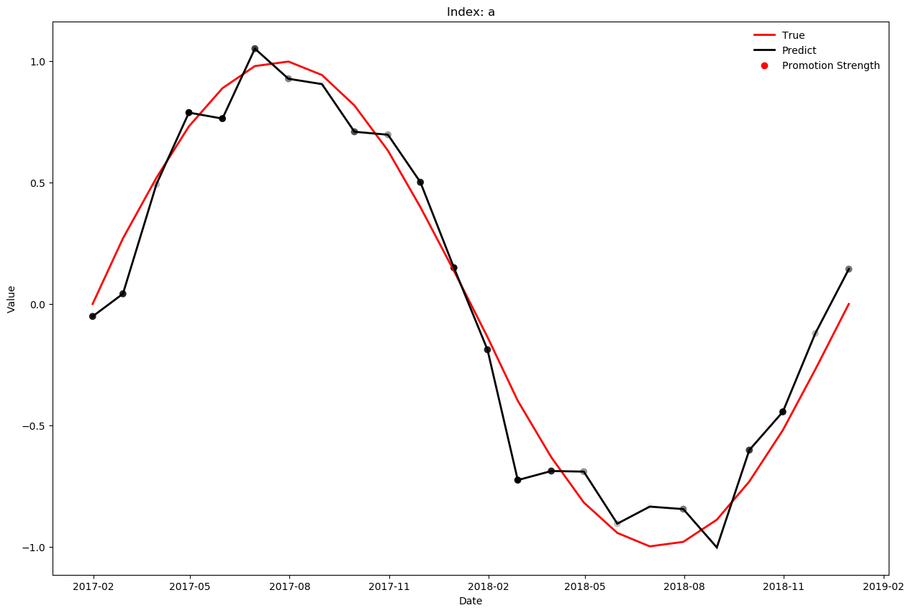

# Reference: https://matplotlib.org/users/customizing.html


```python
import random
import pandas as pd
import numpy as np
import matplotlib.pyplot as plt
import matplotlib as mpl
from cycler import cycler
# plt.style.available
# plt.style.use('ggplot')
```


```python
date_range = pd.date_range("2017-01-01", "2018-12-31", freq="M")
date_size = len(date_range)
data = pd.DataFrame({
    'date': date_range,
    'index': "a",
    'true': np.sin(np.linspace(0, 2 * np.pi, date_size)),
    'predict': np.sin(np.linspace(0, 2 * np.pi, date_size)) + np.random.normal(0, 0.1, date_size),
    'strength': [random.randint(1, 101) for x in range(date_size)],
    })
```

# Colors
See https://matplotlib.org/api/_as_gen/matplotlib.pyplot.colors.html for more information.
- a matplotlib color string, such as r, k https://matplotlib.org/examples/color/named_colors.html
- a rgb tuple, such as (1.0, 0.5, 0.0) 
- a hex string, such as ff00ff
- a scalar grayscale intensity such as 0.75 
- a legal html color name, e.g., red, blue, darkslategray

# FONT
font properties used by text.Text.  

See http://matplotlib.org/api/font_manager_api.html for more information on font properties.  

The 6 font properties used for font matching are given below with their default values.

The font.family property has five values: 'serif' (e.g., Times),
'sans-serif' (e.g., Helvetica), 'cursive' (e.g., Zapf-Chancery),
'fantasy' (e.g., Western), and 'monospace' (e.g., Courier).  Each of
these font families has a default list of font names in decreasing
order of priority associated with them.  When text.usetex is False,
font.family may also be one or more concrete font names.

The font.style property has three values: normal (or roman), italic
or oblique.  The oblique style will be used for italic, if it is not
present.

The font.variant property has two values: normal or small-caps.  For
TrueType fonts, which are scalable fonts, small-caps is equivalent
to using a font size of 'smaller', or about 83%% of the current font
size.

The font.weight property has effectively 13 values: normal, bold,
bolder, lighter, 100, 200, 300, ..., 900.  Normal is the same as
400, and bold is 700.  bolder and lighter are relative values with
respect to the current weight.

The font.stretch property has 11 values: ultra-condensed,
extra-condensed, condensed, semi-condensed, normal, semi-expanded,
expanded, extra-expanded, ultra-expanded, wider, and narrower.  This
property is not currently implemented.

The font.size property is the default font size for text, given in pts.
10 pt is the standard value.


# Overall parameters


```python
x_figsize = 15  # x figure size
font_size = 15 * 4 / 3  # font size
```

# FIGURE
See http://matplotlib.org/api/figure_api.html#matplotlib.figure.Figure


```python
mpl.rcParams['figure.titlesize'] = 'large'  # size of the figure title (Figure.suptitle())
mpl.rcParams['figure.titleweight'] = 'normal'  # weight of the figure title
mpl.rcParams['figure.figsize'] = x_figsize, x_figsize * 2 / 3  # figure size in inches
mpl.rcParams['figure.dpi'] = 100  # figure dots per inch
mpl.rcParams['figure.facecolor'] = 'white'   # figure facecolor; 0.75 is scalar gray
mpl.rcParams['figure.edgecolor'] = 'white'   # figure edgecolor
mpl.rcParams['figure.autolayout'] = False  # When True, automatically adjust subplot parameters to make the plot fit the figure
mpl.rcParams['figure.max_open_warning'] = 20  # The maximum number of figures to open through the pyplot interface before emitting a warning. If less than one this feature is disabled.
mpl.rcParams['figure.subplot.left'] = 0.125  # the left side of the subplots of the figure
mpl.rcParams['figure.subplot.right'] = 0.9    # the right side of the subplots of the figure
mpl.rcParams['figure.subplot.bottom'] = 0.11  # the bottom of the subplots of the figure
mpl.rcParams['figure.subplot.top'] = 0.88  # the top of the subplots of the figure
mpl.rcParams['figure.subplot.wspace'] = 0.2  # the amount of width reserved for blank space between subplots, expressed as a fraction of the average axis width
mpl.rcParams['figure.subplot.hspace'] = 0.2  # the amount of height reserved for white space between subplots, expressed as a fraction of the average axis height
```

# LINES
See http://matplotlib.org/api/artist_api.html#module-matplotlib.lines for more information on line properties.


```python
mpl.rcParams['lines.linewidth'] = 2  # line width in points
mpl.rcParams['lines.linestyle'] = '-'  # solid line
mpl.rcParams['lines.marker'] = None  # the default marker
mpl.rcParams['lines.markeredgewidth'] = 1.0  # the line width around the marker symbol
mpl.rcParams['lines.markersize'] = 6  # markersize, in points
mpl.rcParams['lines.dash_joinstyle'] = 'miter'  # miter|round|bevel
mpl.rcParams['lines.dash_capstyle'] = 'butt'  # butt|round|projecting
mpl.rcParams['lines.solid_joinstyle'] = 'miter'  # miter|round|bevel
mpl.rcParams['lines.solid_capstyle'] = 'projecting'  # butt|round|projecting
mpl.rcParams['lines.antialiased'] = True  # render lines in antialiased (no jaggies)
mpl.rcParams['lines.dashed_pattern'] = 2.8, 1.2
mpl.rcParams['lines.dashdot_pattern'] = 4.8, 1.2, 0.8, 1.2
mpl.rcParams['lines.dotted_pattern'] = 1.1, 1.1
mpl.rcParams['lines.scale_dashes'] = True
mpl.rcParams['markers.fillstyle'] = 'full'  # full|left|right|bottom|top|none
```

# AXES
default face and edge color, default tick sizes, default fontsizes for ticklabels, and so on.  

See http://matplotlib.org/api/axes_api.html#module-matplotlib.axes


```python
mpl.rcParams['axes.facecolor'] = 'w'  # axes background color
mpl.rcParams['axes.edgecolor'] = 'k'  # black   # axes edge color
mpl.rcParams['axes.linewidth'] = 0.8  # edge linewidth
mpl.rcParams['axes.grid'] = False   # display grid or not
mpl.rcParams['axes.titlesize'] = 'large'   # fontsize of the axes title
mpl.rcParams['axes.titlepad'] = 6.0  # pad between axes and title in points
mpl.rcParams['axes.labelsize'] = 'medium'  # fontsize of the x any y labels
mpl.rcParams['axes.labelpad'] = 4.0  # space between label and axis
mpl.rcParams['axes.labelweight'] = 'normal'  # weight of the x and y labels
mpl.rcParams['axes.labelcolor'] = 'k'
mpl.rcParams['axes.axisbelow'] = 'line'  # draw axis gridlines and ticks below patches (True); above patches but below lines ('line'); or above all (False)
mpl.rcParams['axes.formatter.limits'] = -7, 7  # use scientific notation if log10 of the axis range is smaller than the first or larger than the second
mpl.rcParams['axes.formatter.use_locale'] = False  # When True, format tick labels according to the user's locale. For example, use ',' as a decimal separator in the fr_FR locale.
mpl.rcParams['axes.formatter.use_mathtext'] = False  # When True, use mathtext for scientific notation.
mpl.rcParams['axes.formatter.useoffset'] = True  # If True, the tick label formatter will default to labeling ticks relative to an offset when the data range is small compared to the minimum absolute value of the data.
mpl.rcParams['axes.formatter.offset_threshold'] = 4  # When useoffset is True, the offset will be used when it can remove at least this number of significant digits from tick labels.
mpl.rcParams['axes.spines.left'] = True  # display axis spines
mpl.rcParams['axes.spines.bottom'] = True
mpl.rcParams['axes.spines.right'] = True
mpl.rcParams['axes.unicode_minus'] = True  # use unicode for the minus symbol rather than hyphen.  See http://en.wikipedia.org/wiki/Plus_and_minus_signs#Character_codes
mpl.rcParams['axes.prop_cycle'] = cycler('color', ['r', 'k', 'g', 'b', 'm', 'c']) # color cycle for plot lines as list of string colorspecs: single letter, long name, or web-style hex
mpl.rcParams['axes.xmargin'] = 0.05  # x margin.  See `axes.Axes.margins`
mpl.rcParams['axes.ymargin'] = 0.05  # y margin See `axes.Axes.margins`
mpl.rcParams['polaraxes.grid'] = True  # display grid on polar axes
mpl.rcParams['axes3d.grid'] = True  # display grid on 3d axes
# mpl.rcParams['xes.spines.top'] = True
# mpl.rcParams['axes.autolimit_mode'] = data # How to scale axes limits to the data. Use "data" to use data limits, plus some margin. Use "round_number" move to the nearest "round" number
```

# TICKS
see http://matplotlib.org/api/axis_api.html#matplotlib.axis.Tick


```python
mpl.rcParams['xtick.top'] = False  # draw ticks on the top side
mpl.rcParams['xtick.bottom'] = True   # draw ticks on the bottom side
mpl.rcParams['xtick.major.size'] = 3.5      # major tick size in points
mpl.rcParams['xtick.minor.size'] = 2      # minor tick size in points
mpl.rcParams['xtick.major.width'] = 0.8    # major tick width in points
mpl.rcParams['xtick.minor.width'] = 0.6    # minor tick width in points
mpl.rcParams['xtick.major.pad'] = 3.5      # distance to major tick label in points
mpl.rcParams['xtick.minor.pad'] = 3.4      # distance to the minor tick label in points
mpl.rcParams['xtick.color']  = 'k'      # color of the tick labels
mpl.rcParams['xtick.labelsize'] = 'medium' # fontsize of the tick labels
mpl.rcParams['xtick.direction'] = 'out'    # direction: in, out, or inout
mpl.rcParams['xtick.minor.visible'] = False  # visibility of minor ticks on x-axis
mpl.rcParams['xtick.major.top'] = True   # draw x axis top major ticks
mpl.rcParams['xtick.major.bottom'] = True   # draw x axis bottom major ticks
mpl.rcParams['xtick.minor.top'] = True   # draw x axis top minor ticks
mpl.rcParams['xtick.minor.bottom'] = True   # draw x axis bottom minor ticks
mpl.rcParams['ytick.left'] = True  # draw ticks on the left side
mpl.rcParams['ytick.right'] = False  # draw ticks on the right side
mpl.rcParams['ytick.major.size'] = 3.5      # major tick size in points
mpl.rcParams['ytick.minor.size'] = 2      # minor tick size in points
mpl.rcParams['ytick.major.width'] = 0.8    # major tick width in points
mpl.rcParams['ytick.minor.width'] = 0.6    # minor tick width in points
mpl.rcParams['ytick.major.pad'] = 3.5      # distance to major tick label in points
mpl.rcParams['ytick.minor.pad'] = 3.4      # distance to the minor tick label in points
mpl.rcParams['ytick.color'] = 'k'  # color of the tick labels
mpl.rcParams['ytick.labelsize'] = 'medium'  # fontsize of the tick labels
mpl.rcParams['ytick.direction'] = 'out'  # direction: in, out, or inout
mpl.rcParams['ytick.minor.visible'] = False  # visibility of minor ticks on y-axis
mpl.rcParams['ytick.major.left'] = True   # draw y axis left major ticks
mpl.rcParams['ytick.major.right'] = True   # draw y axis right major ticks
mpl.rcParams['ytick.minor.left'] = True   # draw y axis left minor ticks
mpl.rcParams['ytick.minor.right'] = True   # draw y axis right minor ticks
```

# LEGEND


```python
mpl.rcParams['legend.loc'] = 'best'
mpl.rcParams['legend.frameon'] = True  # if True, draw the legend on a background patch
mpl.rcParams['legend.framealpha'] = 0.8  # legend patch transparency
mpl.rcParams['legend.facecolor'] = 'inherit'  # inherit from axes.facecolor; or color spec
mpl.rcParams['legend.edgecolor'] = 'w'  # background patch boundary color
mpl.rcParams['legend.fancybox'] = True  # if True, use a rounded box for the legend background, else a rectangle
mpl.rcParams['legend.shadow'] = False  # if True, give background a shadow effect
mpl.rcParams['legend.numpoints'] = 1  # the number of marker points in the legend line
mpl.rcParams['legend.scatterpoints'] = 1  # number of scatter points
mpl.rcParams['legend.markerscale'] = 1.0  # the relative size of legend markers vs. original
mpl.rcParams['legend.fontsize'] = 'medium'
mpl.rcParams['legend.borderpad'] = 0.4  # border whitespace
mpl.rcParams['legend.labelspacing'] = 0.5  # the vertical space between the legend entries
mpl.rcParams['legend.handlelength'] = 2.0  # the length of the legend lines
mpl.rcParams['legend.handleheight'] = 0.7  # the height of the legend handle
mpl.rcParams['legend.handletextpad'] = 0.8  # the space between the legend line and legend text
mpl.rcParams['legend.borderaxespad'] = 0.5  # the border between the axes and legend edge
mpl.rcParams['legend.columnspacing'] = 2.0  # column separation
```

# PATCHES
Patches are graphical objects that fill 2D space, like polygons or circles.

See http://matplotlib.org/api/artist_api.html#module-matplotlib.patches information on patch properties


```python
mpl.rcParams['patch.linewidth'] = 1  # edge width in points.
mpl.rcParams['patch.facecolor'] = 'C0'
mpl.rcParams['patch.edgecolor'] = 'black'  # if forced, or patch is not filled
mpl.rcParams['patch.force_edgecolor'] = False  # True to always use edgecolor
mpl.rcParams['patch.antialiased'] = True  # render patches in antialiased (no jaggies)
```

# HATCHES


```python
# mpl.rcParams['hatch.color'] = 'k'
# mpl.rcParams['hatch.linewidth'] = 1.0
```

# GRIDS


```python
# mpl.rcParams['grid.color'] = 'b0b0b0'  # grid color
# mpl.rcParams['grid.linestyle'] = '-'  # solid
# mpl.rcParams['grid.linewidth'] = 0.8  # in points
# mpl.rcParams['grid.alpha'] = 1.0  # transparency, between 0.0 and 1.0
```

# SCATTER PLOTS


```python
mpl.rcParams['scatter.marker'] = 'o'  # The default marker type for scatter plots.
```

# TEXT
text properties used by text.Text. See http://matplotlib.org/api/artist_api.html#module-matplotlib.text for more information on text properties


```python
mpl.rcParams['text.color'] = 'black'

# LaTeX customizations. See http://wiki.scipy.org/Cookbook/Matplotlib/UsingTex
mpl.rcParams['text.usetex'] = False  # use latex for all text handling. The following fonts are supported through the usual rc parameter settings: new century schoolbook, bookman, times, palatino, zapf chancery, charter, serif, sans-serif, helvetica, avant garde, courier, monospace, computer modern roman, computer modern sans serif, computer modern typewriter. If another font is desired which can loaded using the LaTeX usepackage command, please inquire at the matplotlib mailing list.
mpl.rcParams['text.latex.unicode'] = False # use "ucs" and "inputenc" LaTeX packages for handling unicode strings.
mpl.rcParams['text.dvipnghack'] = None  # some versions of dvipng don't handle alpha channel properly.  Use True to correct and flush ~/.matplotlib/tex.cache before testing and False to force correction off.  None will try and guess based on your dvipng version
mpl.rcParams['text.hinting'] = 'auto'   # May be one of the following: 'none': Perform no hinting, 'auto': Use FreeType's autohinter, 'native': Use the hinting information in the font file, if available, and if your FreeType library supports it 'either': Use the native hinting information, or the autohinter if none is available. For backward compatibility, this value may also be True === 'auto' or False === 'none'.
mpl.rcParams['text.hinting_factor'] = 8  # Specifies the amount of softness for hinting in the horizontal direction.  A value of 1 will hint to full pixels.  A value of 2 will hint to half pixels etc.
mpl.rcParams['text.antialiased'] = True # If True (default), the text will be antialiased. This only affects the Agg backend.
mpl.rcParams['mathtext.cal'] = 'cursive'
mpl.rcParams['mathtext.rm'] = 'serif'
mpl.rcParams['mathtext.tt'] = 'monospace'
mpl.rcParams['mathtext.it'] = 'serif:italic'
mpl.rcParams['mathtext.bf'] = 'serif:bold'
mpl.rcParams['mathtext.sf'] = 'sans'
mpl.rcParams['mathtext.fontset'] = 'dejavusans'  # Should be 'dejavusans' (default), 'dejavuserif', 'cm' (Computer Modern), 'stix', 'stixsans' or 'custom'
mpl.rcParams['mathtext.fallback_to_cm'] = True  # When True, use symbols from the Computer Modern fonts when a symbol can not be found in one of the custom math fonts.
mpl.rcParams['mathtext.default'] = 'it' # The default font to use for math. Can be any of the LaTeX font names, including the special name "regular" for the same font used in regular text.
# mpl.rcParams['text.latex.preamble'] = ? # IMPROPER USE OF THIS FEATURE WILL LEAD TO LATEX FAILURES AND IS THEREFORE UNSUPPORTED. PLEASE DO NOT ASK FOR HELP. IF THIS FEATURE DOES NOT DO WHAT YOU EXPECT IT TO. preamble is a comma separated list of LaTeX statements that are included in the LaTeX document preamble. An example: text.latex.preamble : usepackage{bm}, usepackage{euler}. The following packages are always loaded with usetex, so beware of package collisions: color, geometry, graphicx, type1cm, textcomp. Adobe Postscript (PSSNFS) font packages may also be loaded, depending on your font settings
```

    /Users/chentinghao/anaconda3/lib/python3.6/site-packages/matplotlib/__init__.py:918: MatplotlibDeprecationWarning: text.dvipnghack is obsolete. Please remove it from your matplotlibrc and/or style files.
      mplDeprecation)


# Plot


```python
fig, ax = plt.subplots()
ax.plot(data["date"].values, data["true"].values, label="True")
ax.plot(data["date"].values, data["predict"].values, label="Predict")
plt.gray()
ax.scatter(
    data["date"].values, 
    data["predict"].values, 
    label="Promotion Strength", 
    c=1 - data["strength"].values
)
ax.legend()
ax.set_title("Index: {}".format(data["index"][0]))
ax.set_xlabel("Date")
ax.set_ylabel("Value")
ax.tick_params()
plt.show()
```





# Boxplot


```python
# mpl.rcParams['boxplot.notch'] = False
# mpl.rcParams['boxplot.vertical'] = True
# mpl.rcParams['boxplot.whiskers'] = 1.5
# mpl.rcParams['boxplot.bootstrap'] = None
# mpl.rcParams['boxplot.patchartist'] = False
# mpl.rcParams['boxplot.showmeans'] = False
# mpl.rcParams['boxplot.showcaps'] = True
# mpl.rcParams['boxplot.showbox'] = True
# mpl.rcParams['boxplot.showfliers'] = True
# mpl.rcParams['boxplot.meanline'] = False
# mpl.rcParams['boxplot.flierprops.color'] = 'k'
# mpl.rcParams['boxplot.flierprops.marker'] = 'o'
# mpl.rcParams['boxplot.flierprops.markerfacecolor'] = 'none'
# mpl.rcParams['boxplot.flierprops.markeredgecolor'] = 'k'
# mpl.rcParams['boxplot.flierprops.markersize'] = 6
# mpl.rcParams['boxplot.flierprops.linestyle'] = 'none'
# mpl.rcParams['boxplot.flierprops.linewidth'] = 1.0
# mpl.rcParams['boxplot.boxprops.color'] = 'k'
# mpl.rcParams['boxplot.boxprops.linewidth'] = 1.0
# mpl.rcParams['boxplot.boxprops.linestyle'] = '-'
# mpl.rcParams['boxplot.whiskerprops.color'] = 'k'
# mpl.rcParams['boxplot.whiskerprops.linewidth'] = 1.0
# mpl.rcParams['boxplot.whiskerprops.linestyle'] = '-'
# mpl.rcParams['boxplot.capprops.color'] = 'k'
# mpl.rcParams['boxplot.capprops.linewidth'] = 1.0
# mpl.rcParams['boxplot.capprops.linestyle'] = '-'
# mpl.rcParams['boxplot.medianprops.color'] = 'C1'
# mpl.rcParams['boxplot.medianprops.linewidth'] = 1.0
# mpl.rcParams['boxplot.medianprops.linestyle'] = '-'
# mpl.rcParams['boxplot.meanprops.color'] = 'C2'
# mpl.rcParams['boxplot.meanprops.marker'] = '^'
# mpl.rcParams['boxplot.meanprops.markerfacecolor'] = 'C2'
# mpl.rcParams['boxplot.meanprops.markeredgecolor'] = 'C2'
# mpl.rcParams['boxplot.meanprops.markersize'] = 6
# mpl.rcParams['boxplot.meanprops.linestyle'] = 'none'
# mpl.rcParams['boxplot.meanprops.linewidth'] = 1.0
```

# DATES
These control the default format strings used in AutoDateFormatter.

Any valid format datetime format string can be used (see the python `datetime` for details).  For example using '%%x' will use the locale date representation '%%X' will use the locale time representation and '%%c' will use the full locale datetime representation.

These values map to the scales: {'year': 365, 'month': 30, 'day': 1, 'hour': 1/24, 'minute': 1 / (24 * 60)}


```python
# date.autoformatter.year     : %Y
# date.autoformatter.month    : %Y-%m
# date.autoformatter.day      : %Y-%m-%d
# date.autoformatter.hour     : %m-%d %H
# date.autoformatter.minute   : %d %H:%M
# date.autoformatter.second   : %H:%M:%S
# date.autoformatter.microsecond   : %M:%S.%f
```

# IMAGES


```python
#image.aspect : equal             # equal | auto | a number
#image.interpolation  : nearest   # see help(imshow) for options
#image.cmap   : viridis           # A colormap name, gray etc...
#image.lut    : 256               # the size of the colormap lookup table
#image.origin : upper             # lower | upper
#image.resample  : True
#image.composite_image : True     # When True, all the images on a set of axes are
                                  # combined into a single composite image before
                                  # saving a figure as a vector graphics file,
                                  # such as a PDF.
```

# CONTOUR PLOTS


```python
#contour.negative_linestyle : dashed # dashed | solid
#contour.corner_mask        : True   # True | False | legacy
```

# ERRORBAR PLOTS


```python
#errorbar.capsize : 0             # length of end cap on error bars in pixels
```

# HISTOGRAM PLOTS


```python
#hist.bins : 10                   # The default number of histogram bins.
                                  # If Numpy 1.11 or later is
                                  # installed, may also be `auto`
```

# Agg rendering
Warning: experimental, 2008/10/10


```python
#agg.path.chunksize : 0           # 0 to disable; values in the range
                                  # 10000 to 100000 can improve speed slightly
                                  # and prevent an Agg rendering failure
                                  # when plotting very large data sets,
                                  # especially if they are very gappy.
                                  # It may cause minor artifacts, though.
                                  # A value of 20000 is probably a good
                                  # starting point.
```

# SAVING FIGURES


```python
#path.simplify : True   # When True, simplify paths by removing "invisible"
                        # points to reduce file size and increase rendering
                        # speed
#path.simplify_threshold : 0.1  # The threshold of similarity below which
                                # vertices will be removed in the simplification
                                # process
#path.snap : True # When True, rectilinear axis-aligned paths will be snapped to
                  # the nearest pixel when certain criteria are met.  When False,
                  # paths will never be snapped.
#path.sketch : None # May be none, or a 3-tuple of the form (scale, length,
                    # randomness).
                    # *scale* is the amplitude of the wiggle
                    # perpendicular to the line (in pixels).  *length*
                    # is the length of the wiggle along the line (in
                    # pixels).  *randomness* is the factor by which
                    # the length is randomly scaled.

# the default savefig params can be different from the display params
# e.g., you may want a higher resolution, or to make the figure
# background white
#savefig.dpi         : figure   # figure dots per inch or 'figure'
#savefig.facecolor   : white    # figure facecolor when saving
#savefig.edgecolor   : white    # figure edgecolor when saving
#savefig.format      : png      # png, ps, pdf, svg
#savefig.bbox        : standard # 'tight' or 'standard'.
                                # 'tight' is incompatible with pipe-based animation
                                # backends but will workd with temporary file based ones:
                                # e.g. setting animation.writer to ffmpeg will not work,
                                # use ffmpeg_file instead
#savefig.pad_inches  : 0.1      # Padding to be used when bbox is set to 'tight'
#savefig.jpeg_quality: 95       # when a jpeg is saved, the default quality parameter.
#savefig.directory   : ~        # default directory in savefig dialog box,
                                # leave empty to always use current working directory
#savefig.transparent : False    # setting that controls whether figures are saved with a
                                # transparent background by default

# tk backend params
#tk.window_focus   : False    # Maintain shell focus for TkAgg

# ps backend params
#ps.papersize      : letter   # auto, letter, legal, ledger, A0-A10, B0-B10
#ps.useafm         : False    # use of afm fonts, results in small files
#ps.usedistiller   : False    # can be: None, ghostscript or xpdf
                                          # Experimental: may produce smaller files.
                                          # xpdf intended for production of publication quality files,
                                          # but requires ghostscript, xpdf and ps2eps
#ps.distiller.res  : 6000      # dpi
#ps.fonttype       : 3         # Output Type 3 (Type3) or Type 42 (TrueType)

# pdf backend params
#pdf.compression   : 6 # integer from 0 to 9
                       # 0 disables compression (good for debugging)
#pdf.fonttype       : 3         # Output Type 3 (Type3) or Type 42 (TrueType)

# svg backend params
#svg.image_inline : True       # write raster image data directly into the svg file
#svg.fonttype : 'path'         # How to handle SVG fonts:
#    'none': Assume fonts are installed on the machine where the SVG will be viewed.
#    'path': Embed characters as paths -- supported by most SVG renderers
#    'svgfont': Embed characters as SVG fonts -- supported only by Chrome,
#               Opera and Safari
#svg.hashsalt : None           # if not None, use this string as hash salt
                               # instead of uuid4

# docstring params
#docstring.hardcopy = False  # set this when you want to generate hardcopy docstring

# Set the verbose flags.  This controls how much information
# matplotlib gives you at runtime and where it goes.  The verbosity
# levels are: silent, helpful, debug, debug-annoying.  Any level is
# inclusive of all the levels below it.  If your setting is "debug",
# you'll get all the debug and helpful messages.  When submitting
# problems to the mailing-list, please set verbose to "helpful" or "debug"
# and paste the output into your report.
#
# The "fileo" gives the destination for any calls to verbose.report.
# These objects can a filename, or a filehandle like sys.stdout.
#
# You can override the rc default verbosity from the command line by
# giving the flags --verbose-LEVEL where LEVEL is one of the legal
# levels, e.g., --verbose-helpful.
#
# You can access the verbose instance in your code
#   from matplotlib import verbose.
#verbose.level  : silent      # one of silent, helpful, debug, debug-annoying
#verbose.fileo  : sys.stdout  # a log filename, sys.stdout or sys.stderr

# Event keys to interact with figures/plots via keyboard.
# Customize these settings according to your needs.
# Leave the field(s) empty if you don't need a key-map. (i.e., fullscreen : '')

#keymap.fullscreen : f, ctrl+f       # toggling
#keymap.home : h, r, home            # home or reset mnemonic
#keymap.back : left, c, backspace    # forward / backward keys to enable
#keymap.forward : right, v           #   left handed quick navigation
#keymap.pan : p                      # pan mnemonic
#keymap.zoom : o                     # zoom mnemonic
#keymap.save : s                     # saving current figure
#keymap.quit : ctrl+w, cmd+w         # close the current figure
#keymap.grid : g                     # switching on/off a grid in current axes
#keymap.yscale : l                   # toggle scaling of y-axes ('log'/'linear')
#keymap.xscale : L, k                # toggle scaling of x-axes ('log'/'linear')
#keymap.all_axes : a                 # enable all axes

# Control location of examples data files
#examples.directory : ''   # directory to look in for custom installation
```

# ANIMATION settings


```python
#animation.html : 'none'           # How to display the animation as HTML in
                                   # the IPython notebook. 'html5' uses
                                   # HTML5 video tag.
#animation.writer : ffmpeg         # MovieWriter 'backend' to use
#animation.codec : h264            # Codec to use for writing movie
#animation.bitrate: -1             # Controls size/quality tradeoff for movie.
                                   # -1 implies let utility auto-determine
#animation.frame_format: 'png'     # Controls frame format used by temp files
#animation.ffmpeg_path: 'ffmpeg'   # Path to ffmpeg binary. Without full path
                                   # $PATH is searched
#animation.ffmpeg_args: ''         # Additional arguments to pass to ffmpeg
#animation.avconv_path: 'avconv'   # Path to avconv binary. Without full path
                                   # $PATH is searched
#animation.avconv_args: ''         # Additional arguments to pass to avconv
#animation.mencoder_path: 'mencoder'
                                   # Path to mencoder binary. Without full path
                                   # $PATH is searched
#animation.mencoder_args: ''       # Additional arguments to pass to mencoder
#animation.convert_path: 'convert' # Path to ImageMagick's convert binary.
                                   # On Windows use the full path since convert
                                   # is also the name of a system tool.
```
